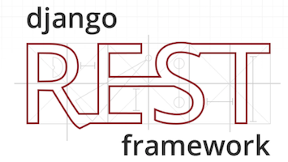

# Heroku Reddit API

A Heroku web app that provides a complete REST API with everything that the Salesforce org client needs to interact with Reddit.
(Authorization, subscriptions to subreddits, get submissions and comments from subreddits, create submissions and comments, reply to comments, upvote/downvote, direct messages to reddit users, ...)

Hosted in: https://reddit-rest-api.herokuapp.com/

## Important paths

* [Authorization](/clients)
* [Redditors](/redditors)
* [Subreddits](/subreddits)
* [Submissions](/submissions)
* [Comments](/comments)

REST API implemented using __DRF__ ([Django Rest Framework](https://www.django-rest-framework.org/)) and using the python package __PRAW__ ([Python Reddit API Wrapper](https://github.com/praw-dev/praw)) to connect with the Reddit's API.

    
    

